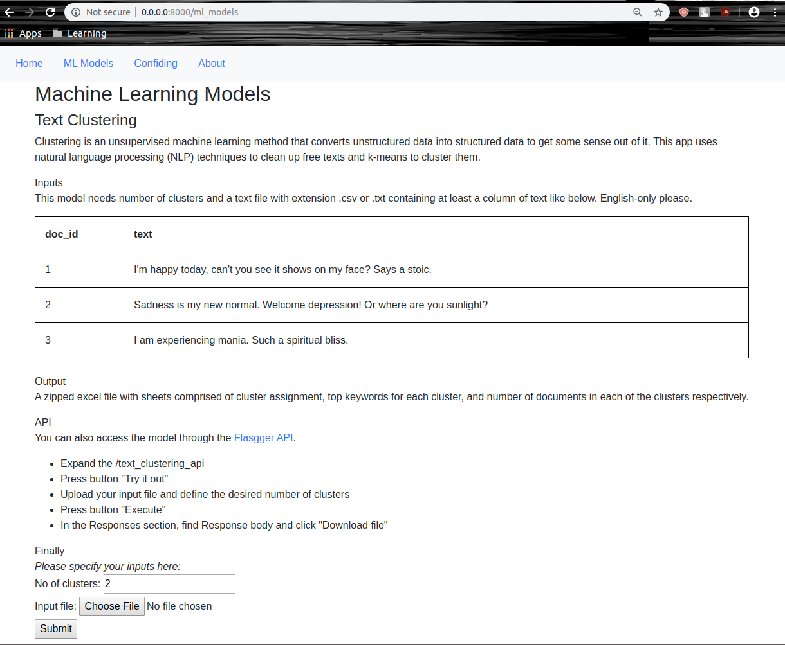
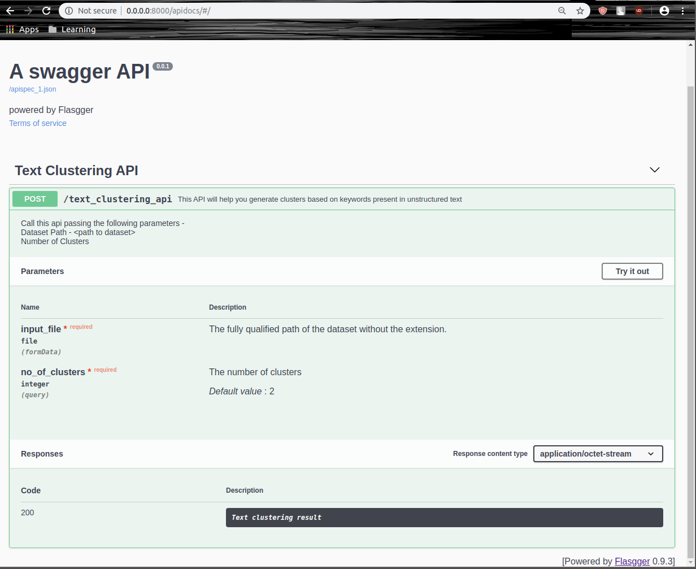

# text-clustering-app
The app cleans up free texts and applies k-means to cluster them. Deployed with docker.

**Tech**
1. Flask
2. Flasgger for API docs UI 
3. WSGI Apache2
4. Docker
   - base: miniconda3

**App look**

